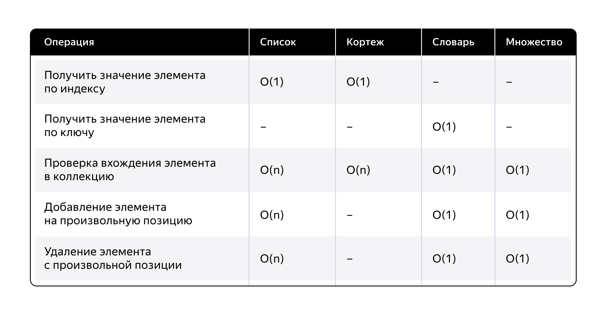

## Содержание

### Основа
- [Алгоритмы сложность, структуры данных](Алгоритмы%20сложность%2C%20структуры%20данных.pdf)
- [Алгоритмы сортировки](Алгоритмы%20сортировки.pdf)
- [Ветвления](Ветвления.pdf)
- [Импортируемые типы данных](Импортируемые%20типы%20данных.pdf)
- [Кортежи](Кортежи.pdf)
- [Множества](Множества.pdf)
- [Модули](Модули.pdf)
- [Модули, пакеты, документирование кода](Python%20модули%2C%20пакеты%2C%20документирование%20кода.pdf)
- [ООП объекты и классы](ООП%20объекты%20и%20классы.pdf)
- [ООП основные принципы](ООП%20основные%20принципы.pdf)
- [Операции с последовательностями, срезы, диапазоны](Операции%20с%20последовательностями%2C%20срезы%2C%20диапазоны.pdf)
- [Простые типы данных](Простые%20типы%20данных.pdf)
- [Пространства имён, итераторы, генераторы, lambda, декораторы](Python%20пространства%20имён%2C%20итераторы%2C%20генераторы%2C%20lambda%2C%20декораторы%20Я.Шпора.pdf)
- [Словари](Словари.pdf)
- [Списки](Списки.pdf)
- [Строки](Строки.pdf)
- [Структуры данных](Структуры%20данных.txt)
- [Требования к коду](Требования%20к%20коду.pdf)
- [Функции](Функции%C2%A0.pdf)
- [Циклы](Циклы.pdf)
- [Инструкция по создания виртуального окружения](инструкция%20создания%20окружения.txt)
- [print(), переменные и константы](print()%2C%20переменные%20и%20константы.pdf)

### Основа 2

- [Типы related - полей в сериализаторах](Сервер/related.pdf)
- [Команды в терминале - Команды в терминале](Сервер/Команды%20в%20терминале%20-%20Команды%20в%20терминале.pdf)
- [Настройка рабочего окружения](Сервер/Настройка%20рабочего%20окружения.pdf)
- [Регулярные выражения](Сервер/Регулярные%20выражения.pdf)
- [Тестирование Pytest](Сервер/Тестирование_%20Pytest.pdf)
- [Тестирование Unittest](Сервер/Тестирование_%20Unittest.pdf)
- [Шпаргалка по коммитам](Сервер/Шпаргалка%20по%20коммитам%20-%20Шпаргалка%20по%20коммитам.pdf)
- [Git и GitHub](Сервер/Git%20и%20GitHub%C2%A0_%20Я.Шпора.pdf)
- [HTML и CSS](Сервер/HTML%20и%20CSS.pdf)
- [Python ошибки, логи, .env](Сервер/Python_%20ошибки%2C%20логи%2C%20.env%C2%A0.pdf)

### Джанго

- [Установка DjDT](Сервер/Django/Установка_DjDT.pdf)
- [ORM выборочное получение данных из БД](Сервер/Django/Django%20ORM_%20выборочное%20получение%20данных%20из%20БД.pdf)
- [ORM модели, миграции, CRUD, выгрузка в JSON](Сервер/Django/Django%20ORM_%20модели%2C%20миграции%2C%20CRUD%2C%20выгрузка%20в%20JSON.pdf)
- [Админ-зона](Сервер/Django/Django_%20админ-зона.pdf)
- [Пагинатор](Сервер/Django/Django_%20пагинатор.pdf)
- [Пользователи](Сервер/Django/Django_%20пользователи.pdf)
- [Правила оформления HTML и шаблонов](Сервер/Django/Django_%20правила%20оформления%20HTML%20и%20шаблонов.pdf)
- [Пути и view-функции](Сервер/Django/Django_%20пути%20и%20view-функции.pdf)
- [Создание проекта и приложений](Сервер/Django/Django_%20создание%20проекта%20и%20приложений.pdf)
- [Формы](Сервер/Django/Django_%20формы.pdf)
- [Шаблонизатор и HTML-шаблоны](Сервер/Django/Django_%20шаблонизатор%20и%20HTML-шаблоны.pdf)
- [Class Based Views](Сервер/Django/Django_%20Class%20Based%20Views.pdf)
- [Описание полей моделей](Сервер/Django/Текстовый%20файл.txt)

### Api и django

- [REST и форматы обмена данными](Сервер/API/API_%20REST%20и%20форматы%20обмена%20данными.pdf)
- [DRF права, лимиты, пагинация, фильтрация, поиск](Сервер/API/DRF_%20права%2C%20лимиты%2C%20пагинация%2C%20фильтрация%2C%20поиск.pdf)
- [DRF Сериализаторы и валидаторы для связанных моделей](Сервер/API/DRF_%20Сериализаторы%20и%20валидаторы%20для%20связанных%20моделей.pdf)
- [DRF сериализация, ViewSet, роутеры](Сервер/API/DRF_%20сериализация%2C%20ViewSet%2C%20роутеры.pdf)
- [Telegram-боты](Сервер/API/API_%20Telegram-боты.pdf)
